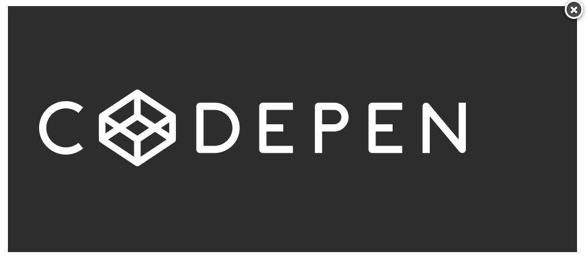
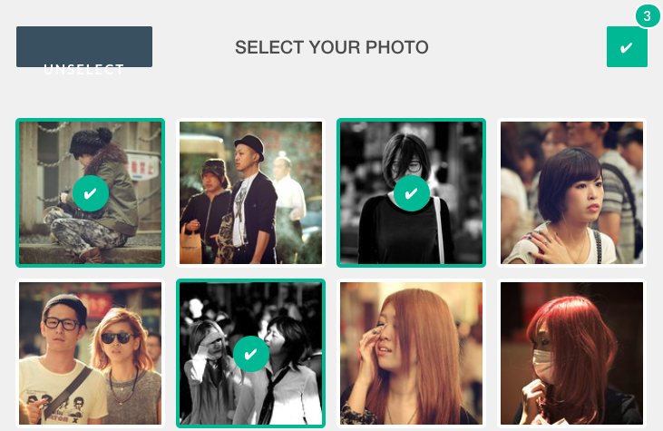

# 圖片

## 圖片刪除按鈕

### [Remove Image Button](https://codepen.io/eliorivero/pen/zEFqb)

*DEMO*



*HTML*

```html
<div class="image-area">
  
  <a class="remove-image" href="#" style="display: inline;">&#215;</a>
</div>
```

*CSS*

```css
body {
  padding: 20px;
}
.image-area {
  position: relative;
  width: 50%;
  background: #333;
}
.image-area img{
  max-width: 100%;
  height: auto;
}
.remove-image {
display: none;
position: absolute;
top: -10px;
right: -10px;
border-radius: 10em;
padding: 2px 6px 3px;
text-decoration: none;
font: 700 21px/20px sans-serif;
background: #555;
border: 3px solid #fff;
color: #FFF;
box-shadow: 0 2px 6px rgba(0,0,0,0.5), inset 0 2px 4px rgba(0,0,0,0.3);
  text-shadow: 0 1px 2px rgba(0,0,0,0.5);
  -webkit-transition: background 0.5s;
  transition: background 0.5s;
}
.remove-image:hover {
 background: #E54E4E;
  padding: 3px 7px 5px;
  top: -11px;
right: -11px;
}
.remove-image:active {
 background: #E54E4E;
  top: -10px;
right: -11px;
}
```


## 圖片選擇列表

### [Bootstrap Snippet select image using HTML](https://bootsnipp.com/snippets/7nkW8)

*DEMO*



```html
<link href="//netdna.bootstrapcdn.com/bootstrap/3.0.0/css/bootstrap.min.css" rel="stylesheet" id="bootstrap-css">
<script src="//netdna.bootstrapcdn.com/bootstrap/3.0.0/js/bootstrap.min.js"></script>
<script src="//code.jquery.com/jquery-1.11.1.min.js"></script>
<!------ Include the above in your HEAD tag ---------->

<!DOCTYPE html><html lang='en' class=''>
<head><script src='//production-assets.codepen.io/assets/editor/live/console_runner-079c09a0e3b9ff743e39ee2d5637b9216b3545af0de366d4b9aad9dc87e26bfd.js'></script><script src='//production-assets.codepen.io/assets/editor/live/events_runner-73716630c22bbc8cff4bd0f07b135f00a0bdc5d14629260c3ec49e5606f98fdd.js'></script><script src='//production-assets.codepen.io/assets/editor/live/css_live_reload_init-2c0dc5167d60a5af3ee189d570b1835129687ea2a61bee3513dee3a50c115a77.js'></script><meta charset='UTF-8'><meta name="robots" content="noindex"><link rel="shortcut icon" type="image/x-icon" href="//production-assets.codepen.io/assets/favicon/favicon-8ea04875e70c4b0bb41da869e81236e54394d63638a1ef12fa558a4a835f1164.ico" /><link rel="mask-icon" type="" href="//production-assets.codepen.io/assets/favicon/logo-pin-f2d2b6d2c61838f7e76325261b7195c27224080bc099486ddd6dccb469b8e8e6.svg" color="#111" /><link rel="canonical" href="https://codepen.io/leonard/pen/foiHb" />


<style class="cp-pen-styles">@import url(https://fonts.googleapis.com/css?family=Lato:400,700);

.clearfix {
  *zoom: 1;
}
.clearfix:after {
  content: "";
  display: table;
  clear: both;
}

body {
  background: #f2f2f2;
  font-family: Lato;
  -webkit-font-smoothing: antialiased;
}

ul, div {
  position: relative;
  margin: 50px auto;
  width: 710px;
  padding: 0;
  list-style: none;
  text-align: center;
  text-transform: uppercase;
  font-weight: 900;
  font-size: 20px;
  line-height: 40px;
  color: #555;
}

h1 {
  position: absolute;
  margin: 0;
  padding: 0;
  width: 710px;
  height: 45px;
  line-height: 45px;
  text-align: center;
  font-size: 1em;
  z-index: -1;
}

img {
  position: absolute;
  margin: auto;
  top: 0; left: 0; bottom: 0; right: 0;
  width: 100%;
  height: 100%;
  border-radius: 1px;
  box-shadow: 0 0 0 4px #fff;
  cursor: pointer;
  animation:        unselected 0.3s cubic-bezier(0.250, 0.100, 0.250, 1.000);
  -o-animation:     unselected 0.3s cubic-bezier(0.250, 0.100, 0.250, 1.000);
  -ms-animation:    unselected 0.3s cubic-bezier(0.250, 0.100, 0.250, 1.000);
  -moz-animation:   unselected 0.3s cubic-bezier(0.250, 0.100, 0.250, 1.000);
  -webkit-animation: unselected 0.3s cubic-bezier(0.250, 0.100, 0.250, 1.000);
}

@keyframes unselected {
  0% { box-shadow: 0 0 0 4px #00c09e; }
  50% { transform: scale(0.5); opacity: 0.8; box-shadow: 0 0 0 4px #fff; }
  80%,100% { width: 100%; height: 100%; box-shadow: 0 0 0 4px #fff; }
}
@-o-keyframes unselected {
  0% { box-shadow: 0 0 0 4px #00c09e; }
  50% { -o-transform: scale(0.5); opacity: 0.8; box-shadow: 0 0 0 4px #fff; }
  80%,100% { width: 100%; height: 100%; box-shadow: 0 0 0 4px #fff; }
}
@-ms-keyframes unselected {
  0% { box-shadow: 0 0 0 4px #00c09e; }
  50% { width: 45%; height: 45%; opacity: 0.8; box-shadow: 0 0 0 4px #fff; }
  80%,100% { width: 100%; height: 100%; box-shadow: 0 0 0 4px #fff; }
}
@-moz-transition unselected {
  0% { box-shadow: 0 0 0 4px #00c09e; }
  50% { -moz-transform: scale(0.5); opacity: 0.8; box-shadow: 0 0 0 4px #fff; }
  80%,100% { width: 100%; height: 100%; box-shadow: 0 0 0 4px #fff; }
}
@-webkit-keyframes unselected {
  0% { box-shadow: 0 0 0 4px #00c09e; }
  50% { -webkit-transform: scale(0.5); opacity: 0.8; box-shadow: 0 0 0 4px #fff; }
  80%,100% { width: 100%; height: 100%; box-shadow: 0 0 0 4px #fff; }
}

li {
  position: relative;
  margin: 10px;
  width: 157px;
  height: 157px;
  float: left;
}

li:before {
  content: "\2714";
  display: block;
  position: absolute;
  margin: auto;
  top: 0; left: 0; bottom: 0; right: 0;
  width: 40px;
  height: 40px;
  line-height: 40px;
  background:  #00c09e;
  border-radius: 50px;
  color: #fff;
  text-align: center;
  font-size: 16px;
  z-index: 10;
  opacity: 0;
  transition:         0.3s linear;
  -o-transition:      0.3s linear;
  -ms-transition:     0.3s linear;
  -moz-transition:    0.3s linear;
  -webkit-transition: 0.3s linear;
  -o-user-select:      none;
  -moz-user-select:    none;
  -webkit-user-select: none;
  cursor: pointer;
}

li.selected:before {
  opacity: 1;
}

/* img selection */

li.selected img {
  box-shadow: 0 0 0 4px #00c09e;
  animation:        selected 0.3s cubic-bezier(0.250, 0.100, 0.250, 1.000);
  -o-animation:     selected 0.3s cubic-bezier(0.250, 0.100, 0.250, 1.000);
  -ms-animation:    selected 0.3s cubic-bezier(0.250, 0.100, 0.250, 1.000);
  -moz-animation:   selected 0.3s cubic-bezier(0.250, 0.100, 0.250, 1.000);
  -webkit-animation: selected 0.3s cubic-bezier(0.250, 0.100, 0.250, 1.000);
}

@keyframes selected {
  0% { border-color: #fff; }
  50% { transform: scale(0.5); opacity: 0.8; box-shadow: 0 0 0 4px #00c09e; }
  80%,100% { width: 100%; height: 100%; box-shadow: 0 0 0 4px #00c09e; }
}
@-o-keyframes selected {
  0% { box-shadow: 0 0 0 4px #fff; }
  50% { -o-transform: scale(0.5); opacity: 0.8; box-shadow: 0 0 0 4px #00c09e; }
  80%,100% { width: 100%; height: 100%; box-shadow: 0 0 0 4px #00c09e; }
}
@-ms-keyframes selected {
  0% { box-shadow: 0 0 0 4px #fff; }
  50% { width: 45%; height: 45%; opacity: 0.8; box-shadow: 0 0 0 4px #00c09e; }
  80%,100% { width: 100%; height: 100%; box-shadow: 0 0 0 4px #00c09e; }
}
@-moz-transition selected {
  0% { box-shadow: 0 0 0 4px #fff; }
  50% { -moz-transform: scale(0.5); opacity: 0.8; box-shadow: 0 0 0 4px #00c09e; }
  80%,100% { width: 100%; height: 100%; box-shadow: 0 0 0 4px #00c09e; }
}
@-webkit-keyframes selected {
  0% { box-shadow: 0 0 0 4px #fff; }
  50% { -webkit-transform: scale(0.5); opacity: 0.8; box-shadow: 0 0 0 4px #00c09e; }
  80%,100% { width: 100%; height: 100%; box-shadow: 0 0 0 4px #00c09e; }
}

/* button */

button {
  height: 45px;
  margin: 0 7px;
  padding: 5px 0;
  font-weight: 700;
  font-size: 15px;
  letter-spacing: 2px;
  color: #fff;
  border: 0;
  border-radius: 2px;
  text-transform: uppercase;
  outline: 0;
}

button.select {
  float: left;
  background: #435a6b;
  cursor: pointer;
  width: 150px;
}

button.select:before, button.select:after {
  position: absolute;
  display: block;
  content:  'select all';
  width: 150px;
  text-align: center;
  transition:         0.1s linear;
  -o-transition:      0.1s linear;
  -ms-transition:     0.1s linear;
  -moz-transition:    0.1s linear;
  -webkit-transition: 0.1s linear;
}

button.select:after {
  content:  'unselect';
  margin-top: 20px;
  opacity: 0;
}

button.select.selected:before {
  transform:         translate(0,-38px);
  -o-transform:      translate(0,-38px);
  -ms-transform:     translate(0,-38px);
  -moz-transform:    translate(0,-38px);
  -webkit-transform: translate(0,-38px);
  opacity: 0;
}

button.select.selected:after {
  transform:         translate(0,-38px);
  -o-transform:      translate(0,-38px);
  -ms-transform:     translate(0,-38px);
  -moz-transform:    translate(0,-38px);
  -webkit-transform: translate(0,-38px);
  opacity: 1;
}

button.send {
  float: right;
  background: #aaa;
  padding: 0px 15px;
  transition:         0.3s linear;
  -o-transition:      0.3s linear;
  -ms-transition:     0.3s linear;
  -moz-transition:    0.3s linear;
  -webkit-transition: 0.3s linear;
}

button.send.selected {
  background: #00c09e;
  cursor: pointer;
}

button.send:after {
  position: absolute;
  content:  attr(data-counter);
  padding: 5px 8px;
  margin: -29px 0 0 0px;
  line-height: 100%;
  border: 2px #fff solid;
  border-radius: 60px;
  background: #00c09e;
  transition:         0.1s linear;
  -o-transition:      0.1s linear;
  -ms-transition:     0.1s linear;
  -moz-transition:    0.1s linear;
  -webkit-transition: 0.1s linear;
  opacity: 0;
}

button.send.selected:after {
  opacity: 1;
}</style></head><body>
<div class="clearfix">
  <button class="select"> </button>
  <h1>select your photo</h1>
  <button class="send " data-counter="0">✔</button>
</div>
<ul>
  <li></li>
  <li></li>
  <li></li>
  <li></li>
  <li></li>
  <li></li>
  <li></li>
  <li></li>
  <li></li>
  <li></li>
  <li></li>
  <li></li>
</ul>
<script src='//production-assets.codepen.io/assets/common/stopExecutionOnTimeout-b2a7b3fe212eaa732349046d8416e00a9dec26eb7fd347590fbced3ab38af52e.js'></script><script src='//cdnjs.cloudflare.com/ajax/libs/jquery/2.1.3/jquery.min.js'></script>
<script >// item selection
$('li').click(function () {
  $(this).toggleClass('selected');
  if ($('li.selected').length == 0)
    $('.select').removeClass('selected');
  else
    $('.select').addClass('selected');
  counter();
});

// all item selection
$('.select').click(function () {
  if ($('li.selected').length == 0) {
    $('li').addClass('selected');
    $('.select').addClass('selected');
  }
  else {
    $('li').removeClass('selected');
    $('.select').removeClass('selected');
  }
  counter();
});

// number of selected items
function counter() {
  if ($('li.selected').length > 0)
    $('.send').addClass('selected');
  else
    $('.send').removeClass('selected');
  $('.send').attr('data-counter',$('li.selected').length);
}

//# sourceURL=pen.js
</script>
</body></html>
```
